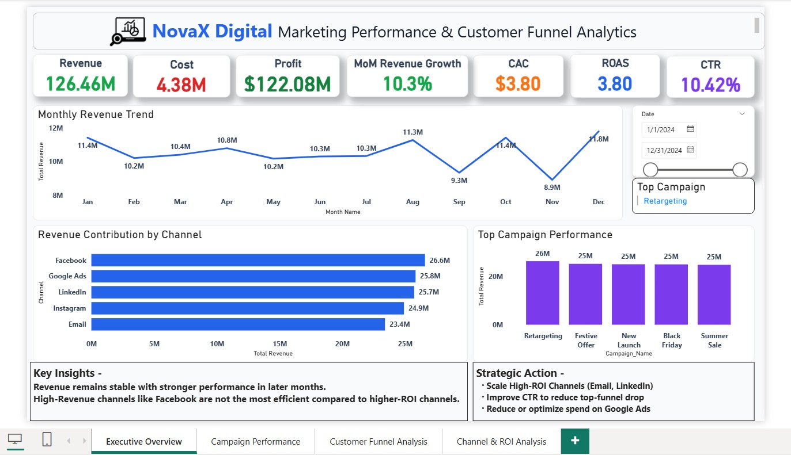
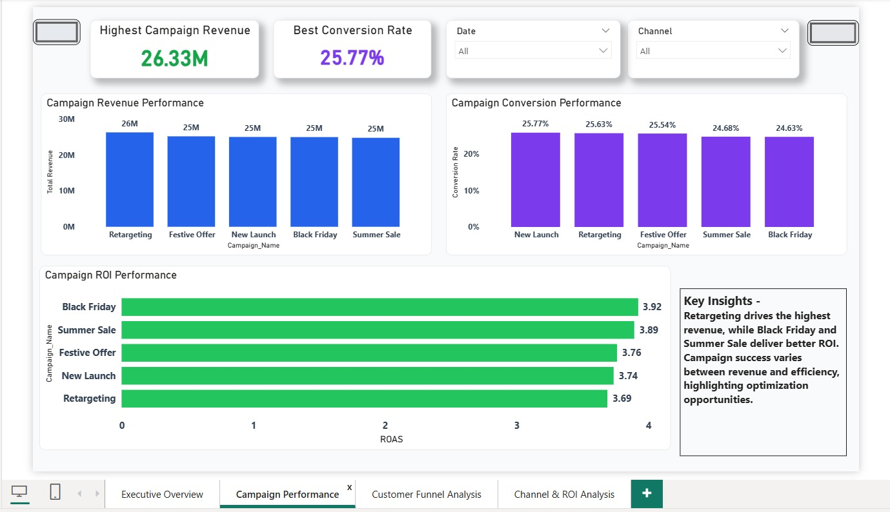
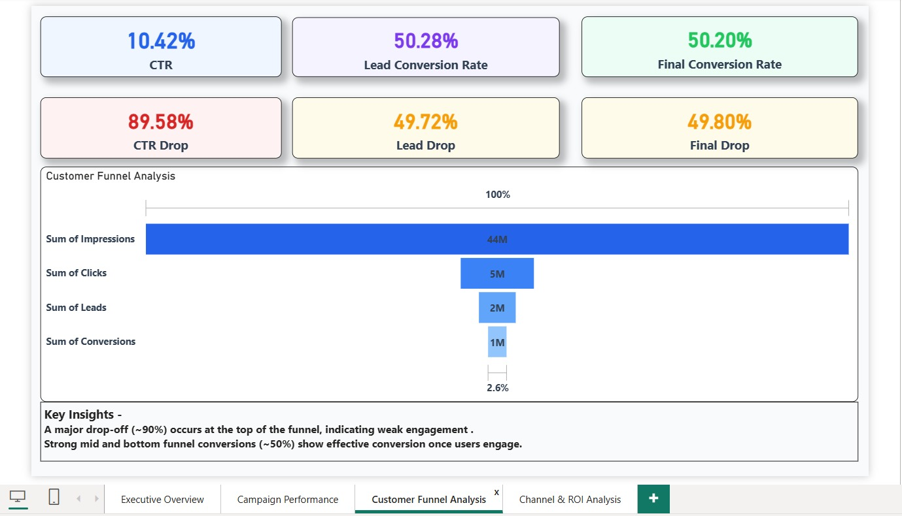
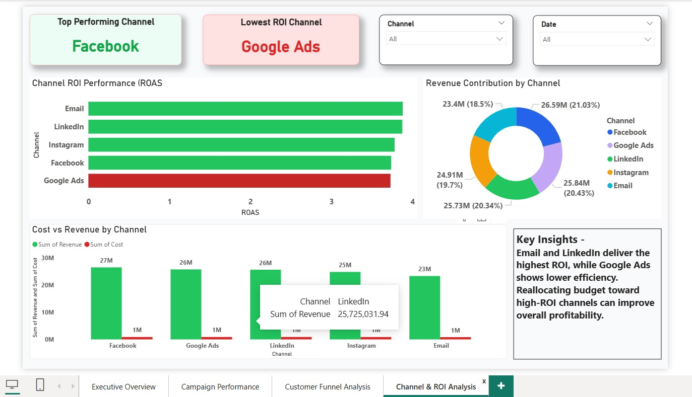

# 📊 Marketing Performance & Customer Funnel Analytics Dashboard

## 🚀 Project Overview
This project presents a comprehensive **Marketing Analytics Dashboard** built in Power BI to analyze campaign performance, customer behavior, and return on investment (ROI) across multiple digital marketing channels.

The dashboard provides an end-to-end view of the marketing funnel, enabling stakeholders to monitor key performance indicators, identify inefficiencies, and make data-driven decisions to optimize marketing strategies and budget allocation.

---

## 🎯 Business Problem
Marketing teams often struggle to:
- Understand which channels drive the most revenue vs. efficiency
- Identify where users drop off in the customer funnel
- Allocate budget effectively across campaigns
- Track performance across multiple KPIs in one place

This dashboard solves these challenges by providing a centralized and interactive analytical view.

---

## 🎯 Objectives
- Track overall business performance (Revenue, Cost, Profit)
- Measure campaign effectiveness across different channels
- Analyze customer funnel stages (Impressions → Clicks → Leads → Conversions)
- Identify conversion drop-offs and bottlenecks
- Evaluate ROI (Return on Ad Spend) for each channel
- Support strategic decision-making using data insights

---

## 📊 Key KPIs
- Total Revenue
- Total Cost
- Profit
- Return on Ad Spend (ROAS)
- Customer Acquisition Cost (CAC)
- Click Through Rate (CTR)
- Lead Conversion Rate
- Final Conversion Rate
- Month-over-Month (MoM) Growth

---

## 📌 Key Insights
- Revenue shows consistent performance with higher growth in later months
- Facebook and Google Ads contribute the highest revenue volume
- Email and LinkedIn channels deliver the highest ROI, indicating better efficiency
- A significant drop-off (~90%) occurs at the top of the funnel (Impressions → Clicks)
- Mid and bottom funnel conversions (~50%) are relatively strong once users engage
- Some high-spend channels show lower efficiency, indicating optimization opportunities

---

## 💡 Strategic Recommendations
- Scale high-performing ROI channels such as Email and LinkedIn
- Improve ad creatives and targeting to increase CTR and reduce top-funnel drop-off
- Optimize or reduce spend on underperforming channels like Google Ads
- Focus on improving engagement in early funnel stages
- Reallocate budget towards high-efficiency campaigns for better profitability

---

## 📷 Dashboard Pages

### 1️⃣ Executive Overview
- High-level KPIs (Revenue, Cost, Profit, ROAS, CAC, CTR)
- Monthly revenue trend analysis
- Channel-wise revenue contribution
- Top-performing campaigns

---

### 2️⃣ Campaign Performance
- Campaign-wise revenue comparison
- Conversion rate analysis across campaigns
- ROI comparison (ROAS)
- Identification of best and worst-performing campaigns

---

### 3️⃣ Customer Funnel Analysis
- Funnel visualization (Impressions → Clicks → Leads → Conversions)
- Drop-off analysis at each stage
- Conversion efficiency tracking

---

### 4️⃣ Channel & ROI Analysis
- Channel-wise ROI performance
- Revenue contribution breakdown
- Cost vs Revenue comparison
- Identification of most efficient channels

---

## 🎥 Demo Video
A screen-recorded demo showcasing dashboard interaction and insights is included in this repository:

📌 File: `marketing_funnel_dashboard_demo.mp4`

---

## 🛠 Tools & Technologies
- Power BI (Data Visualization)
- DAX (Data Analysis Expressions)
- Data Modeling
- Excel / CSV Dataset (for data source)

---

## 📂 Repository Contents
- Dashboard Screenshots (.jpg)
- Demo Video (.mp4)
- README Documentation

---

## 📈 Skills Demonstrated
- Data Cleaning & Transformation
- Data Modeling
- DAX Calculations
- Dashboard Design & Storytelling
- Business Insight Generation
- KPI Analysis
- Data Visualization Best Practices

---

## 👤 Author
**Bidish Ranjan Mund**

---

## ⭐ Project Highlights
- End-to-end business-focused dashboard
- Strong storytelling with insights and recommendations
- Clean and professional UI design
- Real-world marketing analytics use case
- Recruiter-ready portfolio project

---
